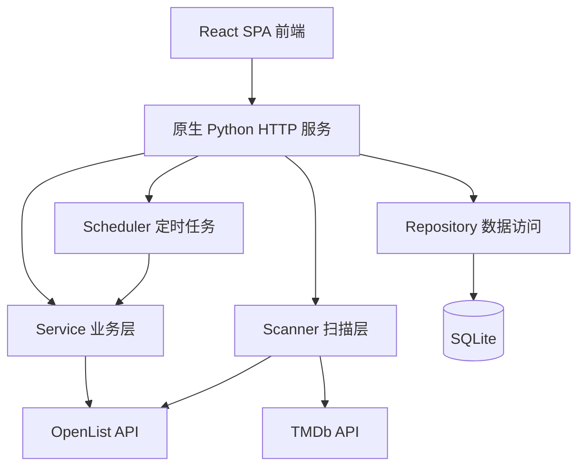
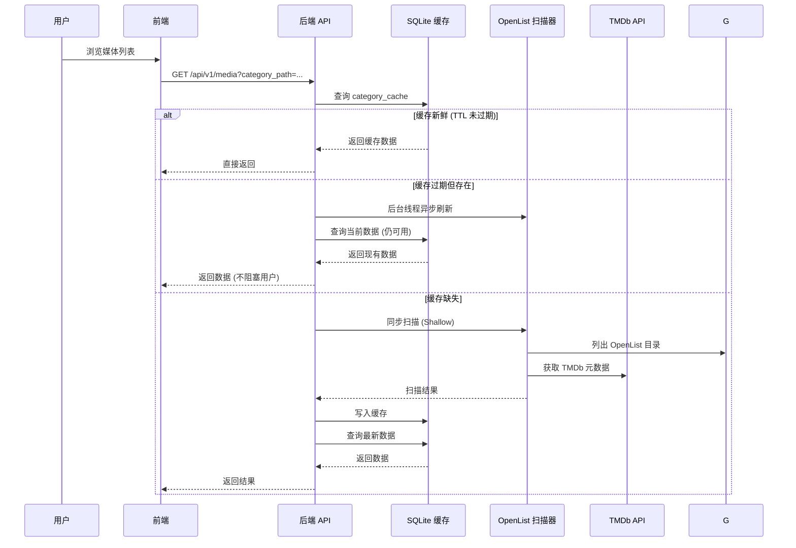

# OpenListMedia 深度架构分析

> 本文档是对 OpenListMedia 项目的全面架构分析，涵盖整体分层、核心工作流、组件职责、数据库设计、安全机制和部署方式。

---

## 目录

1. [整体架构分层](#1-整体架构分层)
2. [核心工作流：按需扫描与缓存](#2-核心工作流按需扫描与缓存)
3. [两级扫描策略](#3-两级扫描策略)
4. [组件职责矩阵](#4-组件职责矩阵)
5. [前端架构 (FSD 风格)](#5-前端架构-fsd-风格)
6. [数据库表结构](#6-数据库表结构)
7. [安全与访问控制](#7-安全与访问控制)
8. [配置管理与热更新](#8-配置管理与热更新)
9. [部署方式](#9-部署方式)
10. [线程安全与并发设计](#10-线程安全与并发设计)
11. [媒体识别规则](#11-媒体识别规则)
12. [历史遗留文件](#12-历史遗留文件)

---

## 1. 整体架构分层



| 层级 | 技术栈 | 职责 |
|------|--------|------|
| **前端** | React 18 + TypeScript + Vite 5 + React Router 6 | SPA 单页应用，6 个核心页面 |
| **后端** | Python 3.9+ 原生 `http.server` / `socketserver` | RESTful API + 静态资源托管 |
| **数据** | SQLite (WAL 模式) | 分类缓存、媒体索引、播放历史、TMDb 缓存 |
| **外部** | OpenList API、TMDb API | 网盘存储 + 元数据补充 |

**特点**：后端不依赖 Flask / FastAPI，直接基于 Python 标准库构建 HTTP 服务。前端为独立 React 工程，生产构建后可由后端静态托管，实现同源部署。

---

## 2. 核心工作流：按需扫描与缓存



**关键实现文件**：
- [`backend/service/media_service.py:197-252`](backend/service/media_service.py:197) — `get_media_list` 方法实现完整的缓存检查与刷新决策
- [`backend/service/media_service.py:254-274`](backend/service/media_service.py:254) — `_schedule_background_refresh` 后台异步刷新机制
- [`backend/scanner/openlist_scanner.py:908-934`](backend/scanner/openlist_scanner.py:908) — `_list_dir` 带重试机制的目录列表请求

**缓存优势**：
- 减少频繁访问 OpenList 带来的延迟
- 降低远程目录扫描成本
- 改善前端翻页、筛选、搜索体验
- 为复杂的排序与筛选提供数据基础

---

## 3. 两级扫描策略

| 扫描级别 | 触发场景 | 扫描内容 | 性能 |
|---------|---------|---------|------|
| **Shallow** | 列表页首次请求、定时刷新 | 仅目录名匹配 + TMDb 元数据 | ⚡ 快 |
| **Detail** | 详情页请求、手动刷新 | 递归扫描文件列表 + 分季分集 | 🐢 慢 |

**Shallow 扫描实现**：[`backend/scanner/openlist_scanner.py:134-209`](backend/scanner/openlist_scanner.py:134)
- 遍历分类下的子目录
- 仅匹配 `MEDIA_PATTERN` 识别媒体目录
- 缓存命中时复用已有数据（`_reuse_shallow_cached_media_item`）
- 缓存未命中时仅获取 TMDb 元数据

**Detail 扫描实现**：[`backend/scanner/openlist_scanner.py:523-645`](backend/scanner/openlist_scanner.py:523)
- 递归扫描媒体目录下的所有文件
- 识别 `SEASON_PATTERN` 和 `EPISODE_PATTERN`
- 获取完整的 TMDb 元数据
- 结果标记 `scan_level: "detail"` 和 `detail_scanned_at`

---

## 4. 组件职责矩阵

| 模块 | 关键文件 | 职责 |
|------|---------|------|
| 应用入口 | [`backend/main.py:6`](backend/main.py:6) | 组装组件，启动 HTTP 服务 |
| 服务工厂 | [`backend/app.py:11`](backend/app.py:11) | 依赖注入，创建服务器实例 |
| 配置加载 | [`backend/config/settings.py:64`](backend/config/settings.py:64) | YAML 解析 + 环境变量覆盖 |
| 路由分发 | [`backend/api/routes/media_routes.py:21`](backend/api/routes/media_routes.py:21) | 16 个 API 端点路由（GET/POST） |
| 业务逻辑 | [`backend/service/media_service.py:24`](backend/service/media_service.py:24) | 缓存管理、播放链接、播放列表 |
| 扫描引擎 | [`backend/scanner/openlist_scanner.py:41`](backend/scanner/openlist_scanner.py:41) | OpenList 目录解析 + TMDb 元数据 |
| 数据访问 | [`backend/repository/media_repository.py:32`](backend/repository/media_repository.py:32) | SQLite CRUD，5 张核心表 |
| 定时任务 | [`backend/scheduler.py`](backend/scheduler.py) | 自研 cron 解析器，定时全量刷新 |
| HTTP 服务器 | [`backend/api/server.py`](backend/api/server.py) | `BackendHTTPRequestHandler` + `ReusableTCPServer` |
| DTO | [`backend/dto/media_dto.py`](backend/dto/media_dto.py) | 前端数据转换层 |
| OpenList SDK | [`openlist_sdk/client.py`](openlist_sdk/client.py) | 可独立使用的 Python SDK |
| TMDb SDK | [`tmdb_sdk.py`](tmdb_sdk.py) | TMDb API 封装 |

**服务编排**：`backend.main.main()` → `backend.app.create_backend_server()` 组装所有组件：
1. 加载配置
2. 创建 `MediaWallService`（含 DB + Scanner）
3. 创建 `ScheduledRefreshRunner` 后台定时刷新
4. 创建 `MediaRoutes` 路由处理器
5. 组装 `BackendHTTPRequestHandler`
6. 启动 `ReusableTCPServer`

---

## 5. 前端架构 (FSD 风格)

```
src/
├── app/          # 路由、全局 Provider、布局
├── pages/        # 6 个页面（口令门、分类、列表、详情、设置、404）
├── features/     # 跨实体能力（media-browser 数据钩子、admin-refresh）
├── entities/     # 领域模型（category-card、media-card）
└── shared/       # API client、工具函数、UI 组件
```

**页面路由**：
| 路径 | 组件 | 权限 |
|------|------|------|
| `/` | `access-gate-page` | 无（未认证入口） |
| `/categories` | `categories-page` | 访客+ |
| `/media` | `media-list-page` | 访客+ |
| `/media/:mediaId` | `media-detail-page` | 访客+ |
| `/settings` | `settings-page` | 仅管理员 |
| `*` | `not-found-page` | 无 |

**API 调用模式**：
- 所有 HTTP 请求通过 [`frontend/src/shared/api/client.ts`](frontend/src/shared/api/client.ts) 的 `requestJson` 函数统一发送
- 错误封装为 `ApiClientError`
- API 端点集中在 [`frontend/src/shared/api/media-api.ts`](frontend/src/shared/api/media-api.ts)
- 访问控制通过 [`frontend/src/app/providers.tsx`](frontend/src/app/providers.tsx) 的 `RequireAuth`/`RequireAdmin` 实现

---

## 6. 数据库表结构

表定义参见 [`backend/repository/media_repository.py:48-162`](backend/repository/media_repository.py:48)

| 表名 | 用途 | 关键字段 |
|------|------|---------|
| `category_cache` | 分类缓存 | `category_path` (PK), `payload_json`, `scanned_at` |
| `media_items` | 媒体条目 | `id` (PK), `category_path`, `media_path` (UNIQUE), `tmdb_id`, `payload_json` |
| `play_history` | 播放历史 | `id` (PK), `media_id` (FK), `tmdb_id`, `played_at` |
| `episode_last_played` | 最后播放集数 | `media_id` (PK, FK), `file_path`, `played_at` |
| `tmdb_cache` | TMDb 元数据缓存 | `cache_key` (PK), `payload_json`, `fetched_at` |

**数据库特性**：
- 使用 WAL 模式提高并发读写性能
- `synchronous=NORMAL` 平衡安全与性能
- `temp_store=MEMORY` 临时表存内存
- `busy_timeout=30000` 避免锁等待超时
- 自动迁移：`_ensure_column` 方法增量添加列
- TMDb 缓存表持久化，减少重复 API 调用

**索引策略**：
- `idx_media_items_category_path` — 加速分类查询
- `idx_media_items_sort_title` — 加速标题排序
- `idx_media_items_tmdb_id` — 加速 TMDb ID 关联查询
- `idx_play_history_played_at` — 加速播放历史排序

---

## 7. 安全与访问控制

### 双口令认证

| 口令 | 配置键 | 默认值 | 角色 |
|------|--------|--------|------|
| 管理员 | `frontend.admin_passcode` | `admin` | 可进入设置页、执行管理操作 |
| 访客 | `frontend.visitor_passcode` | `yancj` | 可浏览分类与媒体内容 |

认证流程：前端通过 `POST /api/v1/auth/login` 提交 `{ passcode }`，后端返回 `{ role: "admin" | "visitor" }`。

### API 保护

| 端点 | 保护机制 | 请求头 |
|------|---------|--------|
| `GET /api/v1/settings` | 管理员口令 | `X-Access-Passcode` |
| `POST /api/v1/settings` | 管理员口令 | `X-Access-Passcode` |
| `GET /api/v1/refresh` | 管理令牌（可选） | `X-Admin-Token` |
| `POST /api/v1/refresh` | 管理令牌（可选） | `X-Admin-Token` |

### 敏感信息覆盖

6 个环境变量可覆盖 YAML 中的敏感字段（[`backend/config/settings.py:214-218`](backend/config/settings.py:214)）：

- `OPENLIST_TOKEN`
- `OPENLIST_PASSWORD`
- `TMDB_READ_ACCESS_TOKEN`
- `TMDB_API_KEY`
- `MEDIA_WALL_ADMIN_TOKEN`
- `MEDIA_WALL_CORS_ALLOW_ORIGINS`（逗号或 `|` 分隔）

**注意**：
- 不要把真实 `config.yml` 提交到代码仓库
- 不要把 OpenList 密码、TMDb 凭证、管理员 token 暴露在前端构建产物中
- 对外服务建议配置反向代理、HTTPS 与访问限制

---

## 8. 配置管理与热更新

### 配置加载优先级

```
环境变量 > config.yml > 默认值
```

实现逻辑：`_env_or_config` 函数（[`backend/config/settings.py:214-218`](backend/config/settings.py:214)）优先检查 `os.environ`，再回退到 YAML 配置。

### 配置热更新

`POST /api/v1/settings` 保存配置后：
1. 深度合并新配置到现有 YAML 文件
2. 调用 `save_config(merged)` 写入磁盘
3. 通过 `_apply_config_reload` 重新加载配置到内存 dataclass
4. **自动重启进程**（[`backend/service/media_service.py:158-186`](backend/service/media_service.py:158)）

**重启条件**（任一字段变化）：
- `backend.host` 变化
- `backend.port` 变化
- `media_wall.database_path` 变化

**重启机制**：`os.execv(sys.executable, [sys.executable, "-m", "backend.main"])` 替换当前进程。

### 配置监听器

[`backend/app.py:21-26`](backend/app.py:21) 注册 `on_config_reload` 回调：
- 更新 `routes.api_prefix`
- 更新 `routes.admin_token`
- 更新 `scheduler` 的 cron 表达式

---

## 9. 部署方式

| 方式 | 命令 | 说明 |
|------|------|------|
| 本地开发后端 | `python -m backend.main` | 监听 `backend.host:backend.port`（默认 `0.0.0.0:8000`） |
| 本地开发前端 | `cd frontend && npm run dev` | Vite 开发服务器（默认 `127.0.0.1:5173`） |
| 生产构建 | `cd frontend && npm run build` | 输出到 `frontend/dist`，由后端静态托管 |
| 生产运行 | `python -m backend.main` | 后端同时提供 API 和静态资源 |
| Docker | `docker compose up -d` | 使用预构建镜像 `ghcr.io/yancj9ya/openlistmedia:latest` |

**Docker 构建**：`Dockerfile` 分两阶段：
1. `node:20-bookworm` — 构建前端（`npm run build`）
2. `python:3.11-slim` — 运行后端，拷贝 `frontend/dist`

**CI/CD**：`.github/workflows/docker-image.yml` 在 push 到 `main`/`master` 时自动构建并推送镜像到 GHCR。

---

## 10. 线程安全与并发设计

### 分类锁机制

[`backend/service/media_service.py:29-31`](backend/service/media_service.py:29) 的 `_category_locks` dict 对每个分类路径维护独立的线程锁，防止同一分类被并发重复扫描。

- `_get_category_lock`: 按需创建按分类路径的锁
- `_category_locks_guard`: 保护锁字典本身的线程安全

### 扫描器线程本地存储

[`backend/scanner/openlist_scanner.py:46-48`](backend/scanner/openlist_scanner.py:46) 使用 `threading.local()` 存储：
- `_scan_local` — 每个线程独立的 `failed_paths` 列表
- `_client_local` — 每个线程独立的 OpenList 客户端实例

### 线程池并发扫描

| 操作 | 线程数 | 位置 |
|------|--------|------|
| 分类计数 | min(len, 8) | [`backend/scanner/openlist_scanner.py:289`](backend/scanner/openlist_scanner.py:289) |
| 深层媒体扫描 | min(len, 16) | [`backend/scanner/openlist_scanner.py:419`](backend/scanner/openlist_scanner.py:419) |
| 季目录扫描 | min(len, 4) | [`backend/scanner/openlist_scanner.py:565`](backend/scanner/openlist_scanner.py:565) |
| 播放列表解析 | min(len, 8) | [`backend/service/media_service.py:746`](backend/service/media_service.py:746) |

### 重试机制

[`backend/scanner/openlist_scanner.py:908-934`](backend/scanner/openlist_scanner.py:908) 的 `_list_dir` 方法：
- 最多重试 `list_retry_count + 1` 次
- 仅对 5xx 错误重试（4xx 直接抛出）
- 指数退避：`delay = retry_delay_seconds * 2^(attempt-1)`

---

## 11. 媒体识别规则

### 核心正则模式

[`backend/scanner/openlist_scanner.py:19-27`](backend/scanner/openlist_scanner.py:19)

```python
MEDIA_PATTERN = r"^(?P<title>.+?)\s*\((?P<year>\d{4})\)\s*\{tmdb-(?P<tmdb_id>\d+)\}\s*$"
SEASON_PATTERN = r"^Season\s+(?P<number>\d+)$"
EPISODE_PATTERN = r"S(?P<season>\d{1,2})E(?P<episode_start>\d{1,3})(?:-E?(?P<episode_end>\d{1,3}))?"
```

### 视频扩展名白名单

[`backend/scanner/openlist_scanner.py:27-38`](backend/scanner/openlist_scanner.py:27)：`.mp4`, `.mkv`, `.avi`, `.ts`, `.m2ts`, `.mov`, `.wmv`, `.flv`, `.mpg`, `.mpeg`

### 媒体类型推断

[`backend/scanner/openlist_scanner.py:779-825`](backend/scanner/openlist_scanner.py:779) 的 `_infer_media_type_from_path`：
- 通过路径层级推断媒体类型：`电影` → movie, `剧集`/`动漫`/`综艺`/`纪录片` → tv
- 也支持英文关键词：`movie`, `tv`, `anime`, `documentary` 等

### 修改影响

改动上述正则或规则会直接影响：
- 媒体目录识别
- TMDb 元数据匹配
- 缓存数据写入
- 前端展示（类型图标、分季分集）

---

## 12. 历史遗留文件

以下文件为项目早期"一次性全量构建静态海报墙"遗留，已统一归档到 `old/`，**不再承载主业务，不要在这里改功能**：

- `old/media_wall_builder.py` — 旧版全量构建脚本
- `old/media_wall_service.py` — 旧版服务入口
- `old/media_wall_site/` — 旧版静态页面目录
- `old/serve_media_wall.py` — 已归档的旧兼容入口
- `old/test_openlist_sdk.py`、`old/test_tmdb_sdk.py` — 依赖真实服务的手动烟雾脚本
- `old/MEDIA_WALL.md` — 旧静态媒体墙说明文档

当前推荐入口：
- 后端：`python -m backend.main`
- 前端开发：`cd frontend && npm run dev`
- 生产部署：构建前端后用 `python -m backend.main` 托管

另外注意 `data/media_wall.db` 是真实运行中的缓存库，体积较大，修改前应先备份。

---

> 本文档基于项目源代码深度分析生成，代码引用行号基于当前版本，后续更新可能导致行号偏移。
